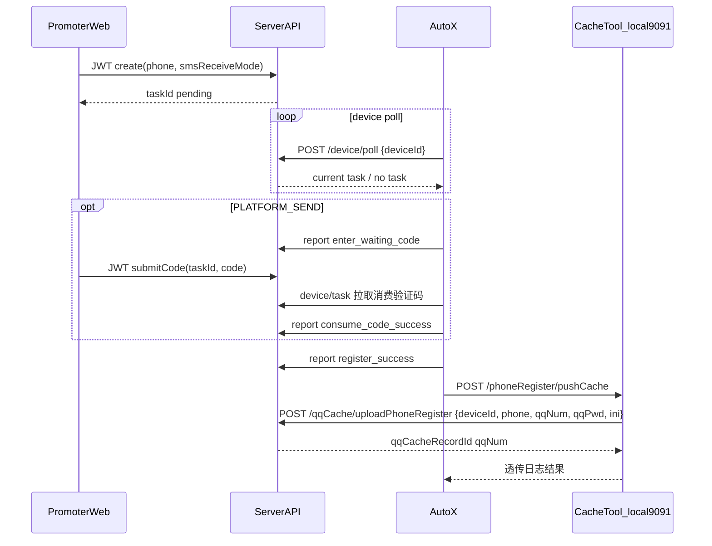

# 手机号注册任务方案（设计文档）

> 本文档由迭代中的产品/技术方案整理归档，便于评审与开发对照；仓库路径：`docs/手机号注册任务方案.md`。

## 实施清单（Todo）

- [ ] **model-migrate**：新增 `SysPhoneRegisterTask`，补状态字段、设备持有字段、心跳字段、超时字段、QQ 关联字段、收码方式字段
- [ ] **service-api**：新增 `phoneRegisterTask` 服务与 API，覆盖 `create` / `submitCode` / `active` / `actives` / `list` / `summary`
- [ ] **device-api**：新增公开设备接口 `device/poll` / `device/task` / `device/heartbeat` / `device/report` / `device/config`
- [ ] **qqcache-device-upload**：新增 `POST /qqCache/uploadPhoneRegister`，按 `deviceId` 绑定当前设备持有任务完成缓存上传闭环
- [ ] **cachetool-local-http**：新增本地 HTTP `pushCache`，从 `SessionData` 读取当前 QQ 与 INI，转发到服务端
- [ ] **web-ui**：提交页支持同页多任务展示；管理员配置页扩展 AutoX 图片识别 provider 配置
- [ ] **autox-loop**：`regQQ` 接入 `poll/task/report/heartbeat/config/pushCache`，支持两种收码模式、昵称密码生成规则、超时失败
- [ ] **init-meta**：按 gin-vue-admin 规范补 `ensure_tables`、API 元数据、菜单、默认菜单关系、可选 Casbin 初始化
- [ ] **migrate-sql**：提供线上数据库增量 `migrate sql`，不依赖线上执行初始化种子

---

## 概要（Overview）

手机号注册任务模块与现有 `SysRegisterTask` / QPI 流程完全隔离，采用 **多设备并行执行** 模型：

- 地推使用 JWT 创建任务
- 服务端以队列形式管理任务
- 多台 AutoX 设备通过公开设备接口拉取任务
- **同一任务同一时刻只允许一个设备执行**
- **同一设备同一时刻只允许持有一条未完成任务**
- 同一手机号允许多任务并存，不做全局唯一限制
- 缓存通过 `AutoX -> CacheTool(127.0.0.1:9091) -> ServerAPI` 上传
- 只有“注册成功且缓存上传成功”后，任务才算最终成功

本次不改动：

- 现有 `/qqCache/extract` 提取链路
- 现有 `SysRegisterTask` 相关 QPI 编排
- 现有 QQ 缓存管理页的主逻辑

---

## 关键结论

### 1. 执行模型

- 系统存在 **多台设备执行**
- 多设备可并行执行不同任务
- 单任务单设备独占
- 单设备单任务串行

### 2. 任务成功标准

- 设备注册成功后，任务先进入 `registered_wait_upload`
- 只有缓存上传成功后，任务才进入 `succeeded`
- `device/report success` **不能**直接将任务置为 `succeeded`

### 3. 上传绑定规则

- `POST /qqCache/uploadPhoneRegister` **不传 `taskId`**
- 请求体传 `deviceId`
- 服务端不把 `deviceId` 当安全凭据，只把它当“路由定位字段”
- 服务端按 `deviceId` 查找“当前设备唯一持有的未完成任务”
- 仅在找到唯一任务时推进该任务为 `succeeded`

### 4. QQ 缓存记录语义

- `SysQQCacheRecord` 表示 **最新 QQ 状态引用**
- 同一 `qq_num` 后续上传会覆盖旧内容
- `qq_cache_record_id` 不是任务历史快照

### 5. 上传安全语义

- 上传链路不做 JWT 鉴权
- 上传链路不做 `taskId` / `uploadToken` / `deviceId` 归属校验
- 该设计是已接受的业务风险，文档中需显式保留

---

## 现状对照

| 维度 | 现有「注册任务」(`server/service/system/register_task.go`) | 本次「手机号注册」 |
| ---- | --- | --- |
| 执行位置 | 服务端 goroutine + QPI | 多台 AutoX 设备 + 本机 QQ + CacheTool |
| 设备拉任务 | 不适用 | 公开 HTTP，无 JWT |
| 并发模式 | 服务端内部串步骤 | 多设备并行，不同任务可同时执行 |
| 收码方式 | 按现有注册任务步骤 | `PLATFORM_SEND` / `USER_SENT_TO_TX` |
| 缓存上传 | 服务端写任务缓存或 App JWT 上传 | `AutoX -> CacheTool 本地 HTTP -> ServerAPI 无 JWT` |
| 成功判定 | 现有任务闭环 | 注册成功且缓存上传成功 |

角色体系维持不变：

- 管理员：`100/888`
- 团长：`200`
- 地推：`300`

---

## 架构与数据流



说明：

- `deviceId` 不是安全凭据，仅是设备持有任务的定位键
- `uploadPhoneRegister` 不传 `taskId`
- 上传成功后服务端按 `deviceId` 绑定唯一持有任务推进到 `succeeded`

---

## 后端设计

### 1. 表 `SysPhoneRegisterTask`

在 `server/model/system/` 下新增任务模型。

建议字段：

- 基础业务字段：
  - `phone`
  - `promoter_id`
  - `leader_id`
  - `sms_receive_mode`
  - `qq_num`
  - `qq_cache_record_id`
- 状态字段：
  - `status`
  - `status_code`
  - `last_error`
  - `finished_at`
- 设备持有字段：
  - `holder_device_id`
  - `claimed_at`
  - `last_heartbeat_at`
- 超时字段：
  - `expires_at`
- 辅助字段：
  - `retry_count`

约束：

- **不对 `phone` 做全局唯一**
- 同一手机号允许多任务并存
- 同一地推允许多任务并存

### 2. 任务状态

建议状态枚举：

- `pending`
- `running`
- `waiting_promoter_code`
- `registered_wait_upload`
- `succeeded`
- `failed`

#### 任务状态流转表

| 当前状态 | 触发事件 | 下一个状态 | 落库变化 | 备注 |
| ---- | ---- | ---- | ---- | ---- |
| `pending` | 地推创建任务 | `pending` | 写入 `phone`、`promoter_id`、`leader_id`、`sms_receive_mode`、`expires_at` | 初始态 |
| `pending` | `device/poll` 领取成功 | `running` | 写入 `holder_device_id`、`claimed_at`、`last_heartbeat_at` | 同一任务同一时刻仅允许一个设备领取 |
| `running` | 进入等待地推验证码步骤 | `waiting_promoter_code` | 刷新 `last_heartbeat_at`，可更新 `last_error` 为等待提示 | 仅 `PLATFORM_SEND` 进入该状态 |
| `waiting_promoter_code` | 地推提交验证码且设备成功消费 | `running` | 清空待消费验证码，刷新 `last_heartbeat_at` | 继续后续执行 |
| `running` | 设备注册成功 | `registered_wait_upload` | 写入阶段性成功摘要，刷新 `last_heartbeat_at` | 此时仅表示注册成功，缓存尚未上传 |
| `registered_wait_upload` | `uploadPhoneRegister` 上传成功 | `succeeded` | 写入 `qq_num`、`qq_cache_record_id`、`finished_at`、`status_code`，清空 `holder_device_id` | 仅此时任务真正成功完成 |
| `pending` / `running` / `waiting_promoter_code` / `registered_wait_upload` | 设备显式失败 | `failed` | 写入 `last_error`、`status_code`、`finished_at`，清空 `holder_device_id` | 终态 |
| `pending` / `running` / `waiting_promoter_code` / `registered_wait_upload` | 任务总超时 `expires_at` 命中 | `failed` | 写入 `last_error`、`status_code`、`finished_at`，清空 `holder_device_id` | 服务端总兜底 |
| `running` / `waiting_promoter_code` / `registered_wait_upload` | 租约超时 / 心跳超时 | `failed` | 写入 `last_error`、`status_code`、`finished_at`，清空 `holder_device_id` | 不自动回 `pending` |
| `succeeded` / `failed` | 重复 `report` / 重复 `upload` | 保持原状态 | 不重复修改终态 | 上传接口可按幂等返回原结果 |

#### 状态流转约束

- `succeeded` 与 `failed` 为终态；进入终态后不再允许正常状态流转
- `device/report register_success` **不能**直接将任务置为 `succeeded`
- 仅 `uploadPhoneRegister` 成功后，任务才允许进入 `succeeded`
- `PLATFORM_SEND` 才允许进入 `waiting_promoter_code`
- `USER_SENT_TO_TX` 不进入 `waiting_promoter_code`
- 地推验证码按 `taskId` 绑定、单次消费
- 服务重启后，`running` / `waiting_promoter_code` / `registered_wait_upload` 保持原状态，等待设备重新 `heartbeat` / `report`

### 3. `status_code` 建议枚举

| `status_code` | 含义 | 适用状态 | 说明 |
| ---- | ---- | ---- | ---- |
| `0` | 成功 | `succeeded` | 缓存上传成功，任务最终完成 |
| `1001` | 设备执行失败 | `failed` | 设备主动 `report fail` 的通用失败 |
| `1002` | 验证码等待超时 | `failed` | `PLATFORM_SEND` 下两轮等待仍未收到地推验证码 |
| `1003` | 设备心跳超时 | `failed` | 设备长时间未 `heartbeat` / `report` |
| `1004` | 任务总超时 | `failed` | 超过 `expires_at` 仍未完成 |
| `1005` | 缓存上传失败 | `failed` | 注册成功但缓存上传最终失败 |
| `1006` | CacheTool 本地读取失败 | `failed` | 本地 HTTP 调用成功但读取 QQ 会话/INI 失败 |
| `1007` | 服务重启后恢复超时失败 | `failed` | 服务恢复后任务未继续推进，最终被超时扫描关闭 |
| `1008` | 地推手动终止 | `failed` | 地推在 Web 端主动结束任务 |
| `1099` | 未知异常 | `failed` | 兜底错误码 |

约束：

- `succeeded` 固定使用 `0`
- `failed` 必须写入非 `0` 的失败码
- 非终态允许 `status_code` 为空

### 4. 建议索引

- `status, id`
- `holder_device_id, status`
- `promoter_id, created_at`
- `phone`
- `qq_cache_record_id`

---

## 路由分层

### 1. PrivateGroup（JWT）

- 地推：
  - `POST /phoneRegisterTask/create`
  - `POST /phoneRegisterTask/submitCode`
  - `GET /phoneRegisterTask/active`
  - `GET /phoneRegisterTask/actives`
  - `POST /phoneRegisterTask/list`
- 团长/管理员：
  - `POST /phoneRegisterTask/list`
  - `GET /phoneRegisterTask/summary`
- 管理员：
  - 注册配置管理页相关接口

### 2. PublicGroup（无 JWT）

- `POST /phoneRegisterTask/device/poll`
- `GET|POST /phoneRegisterTask/device/task`
- `POST /phoneRegisterTask/device/heartbeat`
- `POST /phoneRegisterTask/device/report`
- `GET /phoneRegisterTask/device/config`
- `POST /qqCache/uploadPhoneRegister`

说明：

- 这些接口不注册 Casbin
- `deviceId` 仅作为任务定位键
- 不作为登录态或安全凭据

---

## 设备侧接口约定

### 1. `POST /phoneRegisterTask/device/poll`

设备拉取一个可执行任务。

**请求体：**

```json
{
  "deviceId": "android-001"
}
```

**成功返回：**

```json
{
  "taskId": 123,
  "phone": "13800138000",
  "smsReceiveMode": "PLATFORM_SEND",
  "status": "running",
  "needPromoterCode": false,
  "expiresAt": "<PRIVATE_DATE>",
  "claimedAt": "<PRIVATE_DATE>"
}
```

**无任务返回：**

```json
{
  "taskId": 0
}
```

约束：

- 若该设备已有未完成持有任务，优先返回该任务
- 同一设备同一时刻仅允许持有一条未完成任务

### 2. `GET / POST /phoneRegisterTask/device/task`

查询当前设备持有任务详情。

**请求：**

```json
{
  "deviceId": "android-001"
}
```

**成功返回：**

```json
{
  "taskId": 123,
  "phone": "13800138000",
  "smsReceiveMode": "PLATFORM_SEND",
  "status": "waiting_promoter_code",
  "needPromoterCode": true,
  "expiresAt": "<PRIVATE_DATE>",
  "lastHeartbeatAt": "<PRIVATE_DATE>",
  "verifyCode": "123456"
}
```

**无持有任务返回：**

```json
{
  "taskId": 0
}
```

约束：

- `verifyCode` 仅在存在待消费验证码时返回
- `USER_SENT_TO_TX` 下 `needPromoterCode=false`

### 3. `POST /phoneRegisterTask/device/heartbeat`

设备续租。

**请求体：**

```json
{
  "deviceId": "android-001"
}
```

**成功返回：**

```json
{
  "ok": true
}
```

约束：

- 服务端按 `deviceId` 查找该设备当前唯一持有的未完成任务
- 仅刷新 `last_heartbeat_at`
- 不改变主状态

### 4. `POST /phoneRegisterTask/device/report`

设备上报进度或失败结果。

**请求体：**

```json
{
  "deviceId": "android-001",
  "action": "enter_waiting_code",
  "message": "已进入验证码等待阶段"
}
```

**建议 `action` 枚举：**

- `enter_waiting_code`
- `consume_code_success`
- `register_success`
- `fail`

**通用成功返回：**

```json
{
  "ok": true
}
```

行为：

- `enter_waiting_code`：进入 `waiting_promoter_code`
- `consume_code_success`：从 `waiting_promoter_code` 回到 `running`
- `register_success`：进入 `registered_wait_upload`
- `fail`：进入 `failed`

### 5. `GET /phoneRegisterTask/device/config`

设备获取 AutoX 全局脚本配置。

**请求参数：**

```json
{
  "deviceId": "android-001"
}
```

**成功返回：**

```json
{
  "imageProvider": {
    "enabled": true,
    "provider": "tujian",
    "username": "demo",
    "password": "demo123",
    "secretKey": ""
  }
}
```

---

## QQ 缓存上传闭环

### `POST /qqCache/uploadPhoneRegister`

CacheTool 将本机 QQ 会话缓存上传到服务端，并推进当前设备执行中的任务完成。

**请求体：**

```json
{
  "deviceId": "android-001",
  "phone": "13800138000",
  "qqNum": "12345678",
  "qqPwd": "abcde12345",
  "ini": "...."
}
```

**成功返回：**

```json
{
  "qqCacheRecordId": 456,
  "qqNum": "12345678"
}
```

### 绑定规则

- 请求体不传 `taskId`
- 不做 JWT 校验
- 不做 `deviceId` 鉴权
- 服务端按 `deviceId` 查找该设备当前唯一持有的未完成任务

### 成功行为

若找到唯一任务，则：

- 写入或更新 `SysQQCacheRecord`
- 回填任务的 `qq_num`
- 回填任务的 `qq_cache_record_id`
- 写入 `finished_at`
- 清空 `holder_device_id`
- 将任务推进为 `succeeded`

### 失败行为

- 若未找到任务，返回失败
- 若找到多条未完成任务，返回失败，不做自动猜测绑定

### 语义说明

- `SysQQCacheRecord` 为最新状态引用，不保证历史快照
- 上传成功后任务才真正完成

---

## 收码方式与验证码规则

### 1. 收码方式

建议枚举：

- `PLATFORM_SEND`
- `USER_SENT_TO_TX`

### 2. 创建任务

`POST /phoneRegisterTask/create`

请求体至少包含：

- `phone`
- `smsReceiveMode`

### 3. 提交验证码

`POST /phoneRegisterTask/submitCode`

约束：

- 仅 `PLATFORM_SEND` 可提交
- 仅任务处于 `waiting_promoter_code` 时受理
- 验证码按 `taskId` 绑定
- 单次消费

### 4. AutoX 验证码阶段流程

#### `PLATFORM_SEND`

- AutoX 进入“输入短信验证码”页后，先上报 `enter_waiting_code`
- 第一轮等待地推提交验证码：`120s`
- 等待期间 AutoX 轮询 `GET|POST /phoneRegisterTask/device/task`
- 服务端存在待消费验证码时，在 `verifyCode` 返回；AutoX 填码成功后上报 `consume_code_success`
- 第一轮 `120s` 仍未拿到验证码时，AutoX 主动点击一次“重新发送验证码”
- 重新发码后进入第二轮等待：`120s`
- 第二轮仍未拿到验证码，则任务直接判定失败
- `waitOrSubmitVerifyCode` 的成功判定前置条件：
  - 当前页已不再是“输入短信验证码”页
  - 当前页已不再是“去发送短信 / 我已发送”页
  - 已命中下一个流程的明确页面特征

#### `USER_SENT_TO_TX`

- AutoX 如先进入“输入短信验证码”页，应先点击“收不到短信验证码”切到“去发送短信 / 我已发送”页
- 在“去发送短信 / 我已发送”页最多点击 `3` 次“我已发送”
- 每次点击间隔固定 `10s`
- 若 `3` 次尝试后仍未离开当前验证码相关页面，则任务直接判定失败
- `waitOrSubmitVerifyCode` 的成功判定前置条件与 `PLATFORM_SEND` 保持一致：
  - 当前页已不再是“输入短信验证码”页
  - 当前页已不再是“去发送短信 / 我已发送”页
  - 已命中下一个流程的明确页面特征

### 5. 前端展示规则

- `USER_SENT_TO_TX`：不展示验证码输入区
- `PLATFORM_SEND` 且状态为 `waiting_promoter_code`：展示验证码输入区

---

## 管理员全局图片识别 Provider 配置

该配置仅供 **AutoX 脚本** 消费，不复用现有服务端注册流程中的 `captchaPlatform`。

### 1. 配置归属

- 管理员全局配置
- 所有执行手机号注册任务的 AutoX 设备共享
- 继续挂在现有“注册配置管理”页面中扩展

### 2. 当前支持的 Provider

- `tujian`：图鉴
- `yunma`：云码
- `tuling`：图灵
- `tujie`：图界

### 3. 当前配置模型

建议字段：

- `enabled`
- `provider`
- `username`
- `password`
- `secret_key`
- `updated_at`

### 4. 当前约束

- 当前只支持单个启用中的 provider
- 不支持多 provider 并存
- 不支持自动回退

---

## AutoX 本地生成规则

- 名称：随机 `5-10` 位英文字符，默认使用小写英文
- 密码：固定 `10` 位，前 `5` 位英文，后 `5` 位数字
- 若名称或密码校验失败需要重试，脚本重新生成一组新值，不复用旧值

---

## CacheTool（`QQSessionHttpServer`）

参考：

- `CacheTool/app/src/main/java/com/extracache/logintool/http/QQSessionHttpServer.java`

### 本地 HTTP 路径

建议新增：

- `POST /phoneRegister/pushCache`

### 请求体

```json
{
  "deviceId": "android-001",
  "phone": "13800138000",
  "qqPwd": "abcde12345"
}
```

说明：

- `qqNum` 优先从 `sessionService.readQQSession()` 的 `SessionData` 中获取
- `ini` 由 `readQQSession()` 读取
- AutoX 不直接传 `taskId`

### 行为

- 不校验 Token
- 不校验本地静态密钥
- 可选仅允许本机回环访问
- 读取本机当前 QQ 与 INI 后，调用 `/qqCache/uploadPhoneRegister`

---

## 执行超时与异常处理

### 1. 总超时

- 任务创建时写 `expires_at`
- 超过总超时未完成则直接 `failed`

### 2. 设备租约超时

- 领取任务后开始计算租约
- 依赖 `heartbeat` / `report` 刷新
- 超过租约则直接 `failed`

### 3. 平台发短信等码规则

仅 `PLATFORM_SEND`：

- 第一轮等待验证码：`120s`
- 未收到则触发一次“重新发送验证码”
- 第二轮再等待 `120s`
- 仍未收到则 `failed`

`USER_SENT_TO_TX`：

- AutoX 最多点击 `3` 次“我已发送”
- 每次点击间隔 `10s`
- 若始终未离开验证码相关页面并进入下一个流程特征页，则 `failed`

### 4. 推荐默认值

- 任务总超时：建议固定为 `30m`
- 租约超时：建议固定为 `5m`
- 心跳频率：建议 `30s`
- 超时扫描频率：建议 `1m`

### 5. 失败收尾

- 不自动回 `pending`
- 地推如需重试，重新创建任务

---

## 日志与排查

### 1. 主日志策略

不新增任务日志表，主日志采用服务端结构化日志。

每条关键日志建议带：

- `taskId`
- `deviceId`
- `phone`
- `promoterId`
- `leaderId`
- `status`
- `action`
- `statusCode`

### 2. 任务表摘要字段

任务表保留摘要信息：

- `last_error`
- `status_code`
- `finished_at`

约束：

- 失败时必须写 `last_error`
- `last_error` 仅承担“最近一次错误摘要”职责
- 完整过程排查以结构化服务日志为准

---

## 服务重启恢复规则

- 服务启动后执行一次任务恢复扫描，并持续周期巡检
- `pending` 保持不变
- `running` / `waiting_promoter_code` / `registered_wait_upload` 保持原状态
- 不自动打回 `pending`
- 不因服务刚重启而立即失败
- 设备恢复后，通过 `device/task`、`device/heartbeat`、`device/report` 继续推进任务
- 若设备长期未恢复，超过租约或总超时后转 `failed`
- 若发现同一 `deviceId` 绑定多条未完成任务，设备接口统一返回失败，由后台排查脏数据

---

## Web 展示要求

### 1. 多任务展示

提交页同一视图展示多行任务。

建议列：

- `taskId`
- 创建时间
- 手机号
- 收码方式
- 当前状态
- `qq_num`
- 是否待填码
- 最近错误摘要

### 2. 排序建议

- 默认按 `created_at desc`

### 3. 操作规则

- 仅 `waiting_promoter_code` 状态显示验证码提交操作
- 终态任务不允许再操作
- 列表需强提示 `taskId + 创建时间`，避免同手机号多任务并存时误操作

---

## 初始化与发布策略

本需求按 **新库初始化** 与 **线上增量发布** 两条链路处理。

### 1. 新库初始化

按当前 gin-vue-admin 规范补齐：

- `server/initialize/ensure_tables.go`
- `server/source/system/api.go`
- `server/source/system/menu.go`
- `server/source/system/authorities_menus.go`
- `server/source/system/casbin.go`

目标：

- 表结构完整
- API 元数据完整
- 菜单完整
- 默认菜单关系完整
- 可选默认 Casbin 完整

### 2. 线上增量发布

线上仅提供：

- 数据库 `migrate sql`
- 必要索引 SQL
- 必要兼容性 SQL

线上不提供：

- 菜单初始化 SQL
- API 元数据初始化 SQL
- Casbin 初始化 SQL
- 角色菜单绑定 SQL

约束：

- 线上菜单、角色可见范围、API 权限、Casbin 规则由人工手动配置
- 服务代码必须保证：即使未执行初始化数据灌入，只要数据库结构已升级，服务也能正常启动

### 3. 配置初始化原则

- 新库初始化仅保证结构可用
- 不预填图片识别 provider 的敏感配置
- 线上迁移也仅增加结构，不预填敏感值

---

## 不建议的做法

- 不要让 AutoX 直接带 JWT 调 `/qqCache/upload` 作为主链路
- 不要改动现有 `/qqCache/extract`、提取角色与缓存管理逻辑来迁就本需求
- 不要修改 `SysRegisterTask` 混跑 QPI 流程
- 不要依赖 `phone` 推断缓存上传归属任务

---

## 验收建议

至少覆盖以下场景：

- 多设备并行领取任务
- `PLATFORM_SEND` 两轮等码失败
- `PLATFORM_SEND` 第一轮超时后触发一次“重新发送验证码”再进入第二轮等待
- `USER_SENT_TO_TX` 点击 `3` 次“我已发送”后仍未过页失败
- 验证码阶段只有在离开验证码相关页面且命中下一流程特征后才算成功
- 服务重启后任务保持原状态并可继续推进
- 心跳超时直接失败
- 注册成功但未上传缓存时不算成功
- `uploadPhoneRegister` 成功后才进入 `succeeded`
- 新库初始化后可直接使用
- 线上仅执行 `migrate sql` 后服务可正常启动
